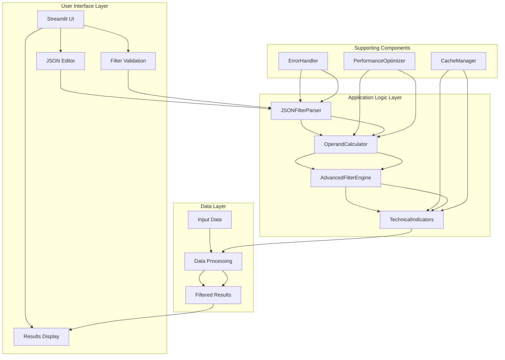
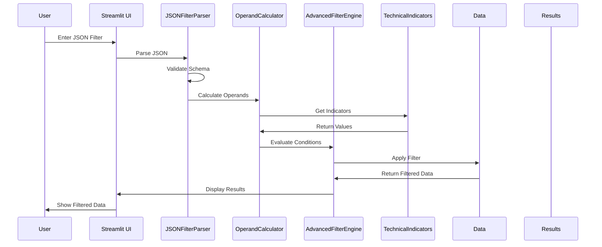

# JSON-Based Filtering System Architecture

## System Overview

The JSON-based filtering system will enhance the existing stock scanner by providing a structured, powerful way to define complex filtering conditions using JSON format. This architecture document outlines the component relationships, data flow, and integration points.

## Component Architecture

## Data Flow Architecture

## Detailed Component Descriptions

### 1. User Interface Layer

#### JSON Editor (`json_filter_ui.py`)
- **Purpose**: Provide user interface for JSON filter input
- **Key Features**:
  - Text area for JSON input
  - Real-time validation feedback
  - Example templates
  - Syntax highlighting (if possible)
- **Methods**:
  - `render_json_editor()`: Render Streamlit components
  - `show_validation_feedback()`: Display validation results
  - `load_examples()`: Load predefined filter examples

#### Filter Validation (`json_filter_ui.py`)
- **Purpose**: Validate JSON structure and content
- **Key Features**:
  - Schema validation
  - Operand type checking
  - Operator validation
  - Error highlighting
- **Methods**:
  - `validate_json_structure()`: Check JSON format
  - `validate_operands()`: Check operand validity
  - `show_errors()`: Display validation errors

#### Results Display (`stock_scanner_main.py`)
- **Purpose**: Display filtered results
- **Key Features**:
  - Interactive data table
  - Sorting and pagination
  - Export options
  - Chart visualization
- **Methods**:
  - `display_results()`: Show filtered data
  - `add_interactivity()`: Add sorting/filtering
  - `export_options()`: Provide export functionality

### 2. Application Logic Layer

#### JSONFilterParser (`json_filter_parser.py`)
- **Purpose**: Parse and validate JSON filter structure
- **Key Features**:
  - JSON schema validation
  - Operand parsing
  - Expression building
  - Error handling
- **Methods**:
  - `validate_json()`: Validate JSON against schema
  - `parse_operands()`: Parse individual operands
  - `build_expression()`: Build executable filter
  - `handle_errors()`: Handle parsing errors

#### OperandCalculator (`operand_calculator.py`)
- **Purpose**: Calculate values for different operand types
- **Key Features**:
  - Column value calculation
  - Indicator computation
  - Offset application
  - Timeframe handling
- **Methods**:
  - `calculate_column()`: Get column values
  - `calculate_indicator()`: Compute indicators
  - `apply_offset()`: Apply time offsets
  - `calculate_constant()`: Return constant values

#### AdvancedFilterEngine (`advanced_filter_engine.py`)
- **Purpose**: Execute JSON-based filters
- **Key Features**:
  - Condition evaluation
  - Logic operator handling
  - Result combination
  - Performance optimization
- **Methods**:
  - `apply_filter()`: Main filter application
  - `evaluate_condition()`: Evaluate single condition
  - `combine_results()`: Combine condition results
  - `optimize_performance()`: Performance optimization

#### TechnicalIndicators (`indicators_module.py`)
- **Purpose**: Calculate technical indicators
- **Key Features**:
  - SMA/EMA calculations
  - Offset support
  - Caching
  - Multiple timeframe support
- **Methods**:
  - `calculate_sma()`: Simple moving average
  - `calculate_ema()`: Exponential moving average
  - `add_all_indicators()`: Add all indicators
  - `calculate_with_offset()`: Calculate with offset

### 3. Data Layer

#### Input Data (`utils_module.py`)
- **Purpose**: Handle data loading and processing
- **Key Features**:
  - File loading (CSV, Excel, Parquet)
  - Data validation
  - Column detection
  - Data cleaning
- **Methods**:
  - `load_file()`: Load data from file
  - `detect_columns()`: Detect column types
  - `process_data()`: Process and clean data
  - `validate_data()`: Validate data quality

#### Data Processing (`utils_module.py`)
- **Purpose**: Process data for filtering
- **Key Features**:
  - Data transformation
  - Indicator calculation
  - Data optimization
  - Error handling
- **Methods**:
  - `transform_data()`: Transform data format
  - `add_technical_indicators()`: Add indicators
  - `optimize_dtypes()`: Optimize data types
  - `handle_missing_data()`: Handle missing values

#### Filtered Results (`stock_scanner_main.py`)
- **Purpose**: Store and manage filtered results
- **Key Features**:
  - Result caching
  - Session state management
  - Export functionality
  - Visualization support
- **Methods**:
  - `store_results()`: Store filtered results
  - `cache_results()`: Cache for performance
  - `export_results()`: Export to various formats
  - `visualize_results()`: Create visualizations

### 4. Supporting Components

#### PerformanceOptimizer (`performance_optimizer.py`)
- **Purpose**: Optimize performance for large datasets
- **Key Features**:
  - Caching
  - Vectorized operations
  - Memory optimization
  - Batch processing
- **Methods**:
  - `cache_indicators()`: Cache indicator calculations
  - `optimize_memory()`: Optimize memory usage
  - `vectorize_operations()`: Use vectorized operations
  - `batch_process()`: Process in batches

#### ErrorHandler (`json_filter_parser.py`)
- **Purpose**: Handle errors gracefully
- **Key Features**:
  - Error detection
  - Error reporting
  - Error recovery
  - User feedback
- **Methods**:
  - `detect_errors()`: Detect various error types
  - `report_errors()`: Report errors to user
  - `recover_from_errors()`: Attempt error recovery
  - `log_errors()`: Log errors for debugging

#### CacheManager (`performance_optimizer.py`)
- **Purpose**: Manage caching for performance
- **Key Features**:
  - Indicator caching
  - Result caching
  - Memory management
  - Cache invalidation
- **Methods**:
  - `cache_data()`: Cache data for reuse
  - `get_cached_data()`: Retrieve cached data
  - `invalidate_cache()`: Clear cache when needed
  - `manage_memory()`: Manage cache memory usage

## Integration Points

### 1. Streamlit Integration
- **File**: `stock_scanner_main.py`
- **Integration Points**:
  - Build Filters tab
  - Results tab
  - Sidebar components
  - Session state management

### 2. Existing Filter System
- **File**: `filters_module.py`
- **Integration Points**:
  - Filter application logic
  - Result handling
  - Error handling
  - Performance optimization

### 3. Data Processing Pipeline
- **File**: `utils_module.py`
- **Integration Points**:
  - Data loading
  - Column detection
  - Indicator calculation
  - Data validation

## Performance Considerations

### 1. Caching Strategy
- **Indicator Caching**: Cache calculated indicators to avoid recomputation
- **Result Caching**: Cache filter results for repeated queries
- **Memory Management**: Optimize memory usage for large datasets

### 2. Optimization Techniques
- **Vectorized Operations**: Use pandas/numpy vectorized operations
- **Lazy Evaluation**: Evaluate operands only when needed
- **Batch Processing**: Process data in batches for large datasets

### 3. Scalability
- **Large Dataset Support**: Handle datasets with millions of rows
- **Parallel Processing**: Use parallel processing where possible
- **Memory Efficiency**: Optimize memory usage for scalability

## Error Handling Strategy

### 1. JSON Validation Errors
- **Schema Validation**: Validate JSON structure before processing
- **Type Checking**: Validate operand types and values
- **Operator Validation**: Ensure operators are supported

### 2. Data Processing Errors
- **Missing Columns**: Handle missing columns gracefully
- **Invalid Data**: Handle invalid or missing data
- **Calculation Errors**: Handle mathematical errors

### 3. User Experience Errors
- **Clear Error Messages**: Provide clear, actionable error messages
- **Error Recovery**: Attempt to recover from errors
- **User Guidance**: Guide users to correct errors

## Security Considerations

### 1. Input Validation
- **JSON Validation**: Strict validation of JSON input
- **Sanitization**: Sanitize user input to prevent injection
- **Error Handling**: Handle malicious input gracefully

### 2. Data Protection
- **Session Security**: Secure session state management
- **Data Privacy**: Protect user data
- **Access Control**: Implement appropriate access controls

## Testing Strategy

### 1. Unit Testing
- **JSON Parser**: Test JSON parsing and validation
- **Operand Calculator**: Test operand calculation accuracy
- **Filter Engine**: Test filter application logic

### 2. Integration Testing
- **End-to-End**: Test complete filter application workflow
- **UI Integration**: Test UI components and interactions
- **Data Flow**: Test data flow between components

### 3. Performance Testing
- **Load Testing**: Test with large datasets
- **Stress Testing**: Test under heavy load
- **Memory Testing**: Test memory usage and optimization

## Deployment Strategy

### 1. Development Environment
- **Local Testing**: Test locally before deployment
- **Integration Testing**: Test with existing components
- **Performance Testing**: Test performance requirements

### 2. Production Deployment
- **Gradual Rollout**: Deploy gradually with feature flags
- **Monitoring**: Monitor performance and errors
- **Rollback Plan**: Prepare rollback plan if needed

### 3. Maintenance
- **Regular Updates**: Regular updates and improvements
- **Bug Fixes**: Prompt bug fixes and patches
- **Performance Tuning**: Ongoing performance optimization

This architecture provides a comprehensive foundation for implementing the JSON-based filtering system while ensuring scalability, performance, and maintainability.