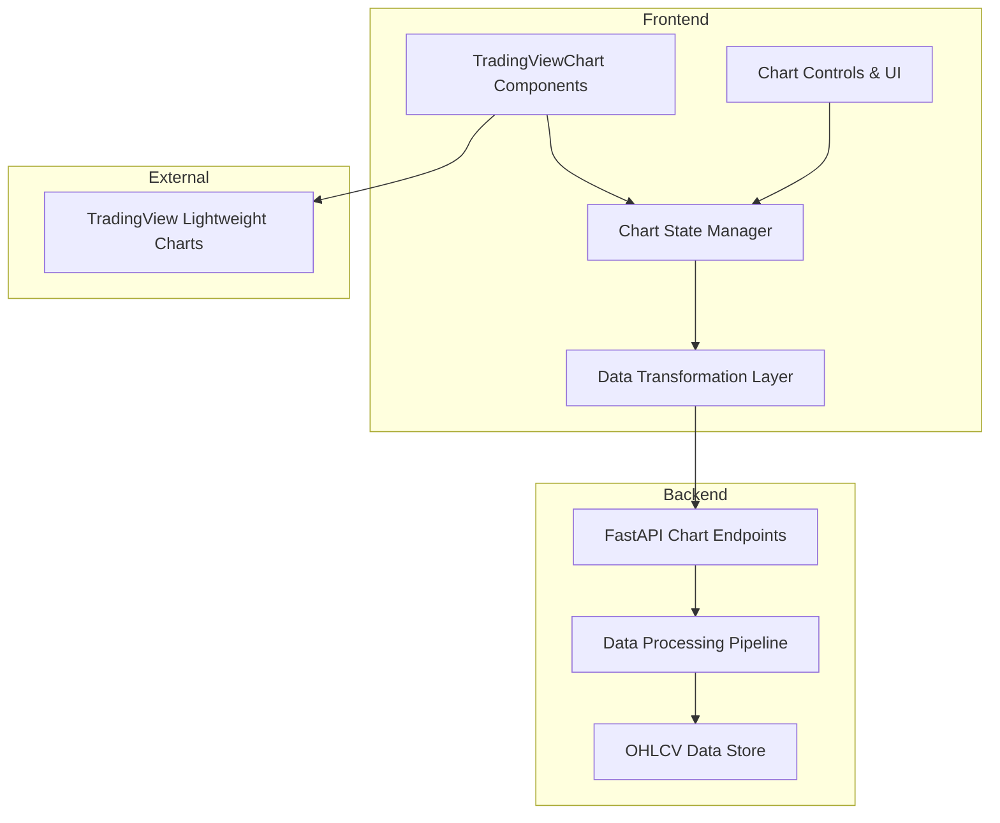

# TradingView Lightweight Charts Migration Architecture Plan

## 📊 Current State Analysis

### Current Implementation
- **Charting Library:** Plotly.js with react-plotly.js (2.6.0)
- **Components:** `EquityCurveChart.js`, `InteractiveCharts.js`
- **Data Flow:** File upload → Backend processing → Frontend display
- **Performance:** Good for basic charts, but limited customization

### Existing Chart Components
```javascript
// Current Plotly-based components
- EquityCurveChart.js (Portfolio performance)
- InteractiveCharts.js (OHLCV visualization)
- PerformanceDashboard.js (Multiple chart types)
```

## 🏗️ Architecture Overview



## 🔧 Key Components

### 1. Data Transformation Layer (`frontend/src/utils/chartDataTransformer.js`)

#### Purpose
Converts existing data formats to TradingView-compatible structures while maintaining performance and compatibility.

#### Key Functions
```javascript
// Core transformation functions
transformOHLCVData(data, timeframe)
transformIndicatorsData(indicators, symbol)
transformAnnotations(annotations)
prepareStreamingData(data, chunkSize)
```

#### Data Format Conversion
```javascript
// Input: Current format
{
  symbol: "AAPL",
  date: "2024-01-01",
  open: 150.25,
  high: 155.50,
  low: 149.75,
  close: 154.25,
  volume: 1000000
}

// Output: TradingView format
{
  time: 1704067200, // Unix timestamp
  open: 150.25,
  high: 155.50,
  low: 149.75,
  close: 154.25,
  volume: 1000000
}
```

### 2. Core Chart Components

#### **`TradingViewChart.js`** - Main Chart Component
```javascript
import React, { useEffect, useRef, useState } from 'react';
import { createChart, CrosshairMode } from 'lightweight-charts';
import { Box, Paper, Typography } from '@mui/material';

const TradingViewChart = ({
  data,
  indicators = [],
  annotations = [],
  chartType = 'candlestick',
  timeframe = '1D',
  onCrosshairMove,
  onVisibleRangeChange
}) => {
  const chartContainerRef = useRef();
  const chartRef = useRef();

  useEffect(() => {
    // Initialize TradingView chart
    const chart = createChart(chartContainerRef.current, {
      layout: {
        background: { type: 'solid', color: '#1a1a1a' },
        textColor: '#d1d4dc',
      },
      grid: {
        vertLines: { color: '#2a2e39' },
        horzLines: { color: '#2a2e39' },
      },
      crosshair: {
        mode: CrosshairMode.Normal,
      },
      rightPriceScale: {
        borderColor: '#485158',
      },
      timeScale: {
        borderColor: '#485158',
        timeVisible: true,
        secondsVisible: false,
      },
      width: chartContainerRef.current.clientWidth,
      height: 500,
    });

    chartRef.current = chart;

    // Add candlestick series
    const candlestickSeries = chart.addCandlestickSeries({
      upColor: '#26a69a',
      downColor: '#ef5350',
      borderVisible: false,
      wickUpColor: '#26a69a',
      wickDownColor: '#ef5350',
    });

    candlestickSeries.setData(data);

    // Add indicators
    indicators.forEach(indicator => {
      addIndicator(chart, indicator);
    });

    // Handle events
    chart.subscribeCrosshairMove(onCrosshairMove);
    chart.timeScale().subscribeVisibleRangeChange(onVisibleRangeChange);

    // Responsive design
    const handleResize = () => {
      chart.applyOptions({
        width: chartContainerRef.current.clientWidth
      });
    };

    window.addEventListener('resize', handleResize);

    return () => {
      window.removeEventListener('resize', handleResize);
      chart.remove();
    };
  }, [data, indicators]);

  return (
    <Paper variant="outlined">
      <Box sx={{ p: 2 }}>
        <Typography variant="h6" gutterBottom>
          {chartType.charAt(0).toUpperCase() + chartType.slice(1)} Chart
        </Typography>
        <div ref={chartContainerRef} style={{ width: '100%' }} />
      </Box>
    </Paper>
  );
};

export default TradingViewChart;
```

#### **`TradingViewCandlestickChart.js`** - OHLCV Visualization
```javascript
const TradingViewCandlestickChart = ({ symbol, data, indicators }) => {
  return (
    <TradingViewChart
      data={data}
      indicators={indicators}
      chartType="candlestick"
      onCrosshairMove={(param) => {
        if (param.time) {
          const data = param.seriesData.get(candlestickSeries);
          console.log('Price at', new Date(param.time * 1000), ':', data);
        }
      }}
    />
  );
};
```

#### **`TradingViewLineChart.js`** - Line/Equity Curve Charts
```javascript
const TradingViewLineChart = ({ data, color = '#1976d2', title = 'Equity Curve' }) => {
  return (
    <TradingViewChart
      data={data}
      chartType="line"
      customOptions={{
        layout: {
          background: { type: 'solid', color: '#1a1a1a' },
        },
      }}
    />
  );
};
```

#### **`TradingViewMultiChart.js`** - Multi-Symbol Comparison
```javascript
const TradingViewMultiChart = ({ symbols, data, layout = 'horizontal' }) => {
  const charts = symbols.map((symbol, index) => (
    <div key={symbol} style={{ height: '300px' }}>
      <TradingViewChart
        data={data[symbol]}
        chartType="candlestick"
        title={symbol}
      />
    </div>
  ));

  return (
    <div style={{
      display: 'grid',
      gridTemplateColumns: layout === 'horizontal' ? 'repeat(auto-fit, minmax(400px, 1fr))' : '1fr',
      gridTemplateRows: layout === 'vertical' ? 'repeat(auto-fit, minmax(300px, 1fr))' : '1fr',
      gap: '16px'
    }}>
      {charts}
    </div>
  );
};
```

### 3. Enhanced Features

#### **Technical Indicators**
```javascript
// Supported indicators
const INDICATORS = {
  sma: { name: 'Simple Moving Average', params: ['period'] },
  ema: { name: 'Exponential Moving Average', params: ['period'] },
  rsi: { name: 'Relative Strength Index', params: ['period'] },
  macd: { name: 'MACD', params: ['fast', 'slow', 'signal'] },
  bb: { name: 'Bollinger Bands', params: ['period', 'stdDev'] },
  stoch: { name: 'Stochastic Oscillator', params: ['k', 'd', 'smooth'] }
};
```

#### **Drawing Tools**
```javascript
const DRAWING_TOOLS = [
  'trendLine',
  'horizontalLine',
  'verticalLine',
  'fibonacciRetracement',
  'rectangle',
  'triangle',
  'circle',
  'arrow',
  'text'
];
```

#### **Chart Controls Component**
```javascript
const ChartControls = ({
  chartType,
  timeframe,
  indicators,
  onChartTypeChange,
  onTimeframeChange,
  onIndicatorAdd,
  onIndicatorRemove
}) => {
  return (
    <Box sx={{ display: 'flex', gap: 2, mb: 2 }}>
      <FormControl size="small">
        <InputLabel>Chart Type</InputLabel>
        <Select value={chartType} onChange={onChartTypeChange}>
          <MenuItem value="candlestick">Candlestick</MenuItem>
          <MenuItem value="line">Line</MenuItem>
          <MenuItem value="area">Area</MenuItem>
          <MenuItem value="bar">Bar</MenuItem>
        </Select>
      </FormControl>

      <FormControl size="small">
        <InputLabel>Timeframe</InputLabel>
        <Select value={timeframe} onChange={onTimeframeChange}>
          <MenuItem value="1D">1D</MenuItem>
          <MenuItem value="5D">5D</MenuItem>
          <MenuItem value="1M">1M</MenuItem>
          <MenuItem value="6M">6M</MenuItem>
          <MenuItem value="1Y">1Y</MenuItem>
          <MenuItem value="5Y">5Y</MenuItem>
          <MenuItem value="MAX">MAX</MenuItem>
        </Select>
      </FormControl>

      <IndicatorSelector
        availableIndicators={INDICATORS}
        activeIndicators={indicators}
        onAdd={onIndicatorAdd}
        onRemove={onIndicatorRemove}
      />
    </Box>
  );
};
```

### 4. API Endpoints

#### **Backend API Updates** (`backend/chart_api.py`)
```python
from fastapi import APIRouter, HTTPException, Query
from pydantic import BaseModel
from typing import List, Dict, Optional
import pandas as pd

router = APIRouter()

class ChartDataRequest(BaseModel):
    symbol: str
    timeframe: str = "1D"
    start_date: Optional[str] = None
    end_date: Optional[str] = None
    indicators: List[Dict] = []

class ChartDataResponse(BaseModel):
    symbol: str
    data: List[Dict]
    indicators: Dict[str, List[Dict]]
    metadata: Dict

@router.get("/api/charts/{symbol}/ohlcv", response_model=ChartDataResponse)
async def get_chart_data(
    symbol: str,
    timeframe: str = "1D",
    limit: int = Query(default=1000, le=5000)
):
    """Get OHLCV data for a symbol optimized for TradingView"""
    try:
        # Get data from existing pipeline
        data = await get_processed_data(symbol, timeframe, limit)

        # Transform to TradingView format
        transformed_data = transform_to_tradingview_format(data)

        return ChartDataResponse(
            symbol=symbol,
            data=transformed_data,
            indicators={},
            metadata={"timeframe": timeframe, "count": len(transformed_data)}
        )
    except Exception as e:
        raise HTTPException(status_code=500, detail=str(e))

@router.get("/api/charts/{symbol}/indicators")
async def get_chart_indicators(
    symbol: str,
    indicators: str,  # JSON string of indicators
    timeframe: str = "1D"
):
    """Get technical indicators for a symbol"""
    try:
        indicator_list = json.loads(indicators)
        results = {}

        for indicator in indicator_list:
            name = indicator['name']
            params = indicator.get('params', {})

            # Calculate indicator using existing logic
            indicator_data = await calculate_indicator(symbol, name, params, timeframe)
            results[name] = indicator_data

        return {"indicators": results}
    except Exception as e:
        raise HTTPException(status_code=500, detail=str(e))

@router.post("/api/charts/{symbol}/annotations")
async def save_chart_annotations(symbol: str, annotations: Dict):
    """Save chart annotations and drawings"""
    try:
        # Save annotations to database/cache
        await save_annotations(symbol, annotations)
        return {"status": "success"}
    except Exception as e:
        raise HTTPException(status_code=500, detail=str(e))

@router.get("/api/charts/config")
async def get_chart_config():
    """Get chart configuration and defaults"""
    return {
        "themes": ["dark", "light"],
        "defaultTheme": "dark",
        "indicators": INDICATORS,
        "drawingTools": DRAWING_TOOLS,
        "timeframes": ["1D", "5D", "1M", "6M", "1Y", "5Y", "MAX"]
    }
```

### 5. Chart State Management

#### **Chart State Manager** (`frontend/src/hooks/useChartState.js`)
```javascript
import { useState, useCallback, useRef } from 'react';

export const useChartState = (initialData = []) => {
  const [data, setData] = useState(initialData);
  const [indicators, setIndicators] = useState([]);
  const [annotations, setAnnotations] = useState([]);
  const [chartType, setChartType] = useState('candlestick');
  const [timeframe, setTimeframe] = useState('1D');
  const [isLoading, setIsLoading] = useState(false);
  const [error, setError] = useState(null);

  const chartRef = useRef(null);

  const updateData = useCallback((newData) => {
    setData(newData);
  }, []);

  const addIndicator = useCallback((indicator) => {
    setIndicators(prev => [...prev, indicator]);
  }, []);

  const removeIndicator = useCallback((indicatorId) => {
    setIndicators(prev => prev.filter(ind => ind.id !== indicatorId));
  }, []);

  const addAnnotation = useCallback((annotation) => {
    setAnnotations(prev => [...prev, annotation]);
  }, []);

  const updateAnnotation = useCallback((annotationId, updates) => {
    setAnnotations(prev =>
      prev.map(ann =>
        ann.id === annotationId ? { ...ann, ...updates } : ann
      )
    );
  }, []);

  const removeAnnotation = useCallback((annotationId) => {
    setAnnotations(prev => prev.filter(ann => ann.id !== annotationId));
  }, []);

  const resetChart = useCallback(() => {
    setData(initialData);
    setIndicators([]);
    setAnnotations([]);
    setChartType('candlestick');
    setTimeframe('1D');
    setError(null);
  }, [initialData]);

  return {
    // State
    data,
    indicators,
    annotations,
    chartType,
    timeframe,
    isLoading,
    error,
    chartRef,

    // Actions
    updateData,
    addIndicator,
    removeIndicator,
    addAnnotation,
    updateAnnotation,
    removeAnnotation,
    setChartType,
    setTimeframe,
    setIsLoading,
    setError,
    resetChart,
  };
};
```

## 🚀 Migration Strategy

### Phase 1: Foundation (Week 1-2)
1. **Install Dependencies**
   ```bash
   npm install lightweight-charts
   npm install @types/lightweight-charts
   ```

2. **Create Data Transformation Layer**
   - Implement `chartDataTransformer.js`
   - Create TradingView format converters
   - Add data validation and error handling

3. **Basic Chart Component**
   - Implement `TradingViewChart.js`
   - Add responsive design
   - Basic event handling

4. **State Management**
   - Create `useChartState` hook
   - Implement data synchronization
   - Add loading and error states

### Phase 2: Core Features (Week 3-4)
1. **Chart Types Implementation**
   - Candlestick charts
   - Line charts
   - Area charts
   - Bar charts

2. **Timeframe Controls**
   - Timeframe selector component
   - Data fetching for different periods
   - Chart updates on timeframe change

3. **Chart Toolbar**
   - Drawing tools integration
   - Zoom and pan controls
   - Fullscreen mode

4. **Data Integration**
   - Connect to existing API endpoints
   - Implement data streaming
   - Add caching layer

### Phase 3: Advanced Features (Week 5-6)
1. **Technical Indicators**
   - SMA, EMA, RSI implementation
   - MACD, Bollinger Bands
   - Stochastic Oscillator

2. **Multi-Chart Layouts**
   - Horizontal/vertical layouts
   - Chart synchronization
   - Symbol comparison

3. **Drawing Tools**
   - Trend lines and annotations
   - Fibonacci retracements
   - Text and shapes

4. **Export/Import**
   - Chart configurations
   - Annotations and drawings
   - Data export functionality

### Phase 4: Integration & Testing (Week 7-8)
1. **Replace Existing Components**
   - Gradual migration from Plotly
   - Compatibility layer
   - Feature parity testing

2. **API Optimization**
   - New chart-specific endpoints
   - Performance optimization
   - Caching implementation

3. **Testing**
   - Unit tests for components
   - Integration tests
   - Performance benchmarks

4. **Documentation**
   - API documentation
   - User guides
   - Migration guide

## 📈 Performance Optimizations

### Data Streaming
```javascript
// Load data incrementally as user scrolls
const useDataStreaming = (initialData, chunkSize = 1000) => {
  const [visibleData, setVisibleData] = useState(initialData.slice(0, chunkSize));
  const [allData] = useState(initialData);

  const loadMoreData = useCallback((startIndex, endIndex) => {
    const newData = allData.slice(startIndex, endIndex);
    setVisibleData(newData);
  }, [allData]);

  return { visibleData, loadMoreData };
};
```

### Memory Management
```javascript
// Efficient data structures and cleanup
const useMemoryOptimizedChart = () => {
  const cleanupRef = useRef();

  useEffect(() => {
    return () => {
      // Cleanup chart instance and data
      if (cleanupRef.current) {
        cleanupRef.current();
      }
    };
  }, []);

  const setCleanup = useCallback((cleanupFn) => {
    cleanupRef.current = cleanupFn;
  }, []);

  return { setCleanup };
};
```

### Caching Layer
```javascript
// Chart configurations and frequently accessed data
const useChartCache = () => {
  const cache = useRef(new Map());

  const getCachedData = useCallback((key) => {
    return cache.current.get(key);
  }, []);

  const setCachedData = useCallback((key, data, ttl = 300000) => {
    cache.current.set(key, {
      data,
      timestamp: Date.now(),
      ttl
    });

    // Auto-cleanup expired entries
    setTimeout(() => {
      cache.current.delete(key);
    }, ttl);
  }, []);

  return { getCachedData, setCachedData };
};
```

## 🔄 Migration Utilities

### Compatibility Layer (`frontend/src/utils/chartMigrationHelper.js`)
```javascript
// Gradual migration from Plotly to TradingView
export const ChartMigrationHelper = {
  // Feature parity checking
  checkFeatureParity: (plotlyConfig, tradingViewConfig) => {
    const plotlyFeatures = extractPlotlyFeatures(plotlyConfig);
    const tradingViewFeatures = extractTradingViewFeatures(tradingViewConfig);

    return {
      supported: plotlyFeatures.filter(f => tradingViewFeatures.includes(f)),
      unsupported: plotlyFeatures.filter(f => !tradingViewFeatures.includes(f)),
      newFeatures: tradingViewFeatures.filter(f => !plotlyFeatures.includes(f))
    };
  },

  // Automatic data format conversion
  convertPlotlyToTradingView: (plotlyData) => {
    return {
      time: plotlyData.x.map(x => new Date(x).getTime() / 1000),
      open: plotlyData.open,
      high: plotlyData.high,
      low: plotlyData.low,
      close: plotlyData.close,
      volume: plotlyData.volume
    };
  },

  // Error handling and fallbacks
  createFallbackChart: (error, originalData) => {
    console.warn('TradingView chart failed, falling back to Plotly:', error);
    return <PlotlyChart data={originalData} />;
  }
};
```

### Configuration Management
```javascript
// Chart themes and layouts
export const ChartConfigManager = {
  themes: {
    dark: {
      background: '#1a1a1a',
      textColor: '#d1d4dc',
      gridColor: '#2a2e39',
      upColor: '#26a69a',
      downColor: '#ef5350'
    },
    light: {
      background: '#ffffff',
      textColor: '#191919',
      gridColor: '#e1e1e1',
      upColor: '#089981',
      downColor: '#f23645'
    }
  },

  // User preferences persistence
  saveUserPreferences: (preferences) => {
    localStorage.setItem('chartPreferences', JSON.stringify(preferences));
  },

  loadUserPreferences: () => {
    const saved = localStorage.getItem('chartPreferences');
    return saved ? JSON.parse(saved) : getDefaultPreferences();
  }
};
```

## 🧪 Testing Strategy

### Unit Tests
```javascript
// Chart components testing
describe('TradingViewChart', () => {
  test('renders without crashing', () => {
    render(<TradingViewChart data={mockData} />);
    expect(screen.getByRole('img')).toBeInTheDocument();
  });

  test('handles data updates', () => {
    const { rerender } = render(<TradingViewChart data={initialData} />);
    rerender(<TradingViewChart data={updatedData} />);
    expect(chartInstance.setData).toHaveBeenCalledWith(updatedData);
  });

  test('adds indicators correctly', () => {
    render(<TradingViewChart data={data} indicators={[smaIndicator]} />);
    expect(chartInstance.addLineSeries).toHaveBeenCalled();
  });
});
```

### Integration Tests
```javascript
// Chart + API integration
describe('Chart Integration', () => {
  test('loads data from API', async () => {
    render(<TradingViewChart symbol="AAPL" />);
    await waitFor(() => {
      expect(api.getChartData).toHaveBeenCalledWith('AAPL');
    });
  });

  test('handles API errors gracefully', async () => {
    mockApiError();
    render(<TradingViewChart symbol="INVALID" />);
    await waitFor(() => {
      expect(screen.getByText('Error loading chart data')).toBeInTheDocument();
    });
  });
});
```

### Performance Tests
```javascript
// Large dataset handling
describe('Performance', () => {
  test('handles 10k data points', () => {
    const largeData = generateLargeDataset(10000);
    const startTime = performance.now();

    render(<TradingViewChart data={largeData} />);
    const endTime = performance.now();

    expect(endTime - startTime).toBeLessThan(1000); // Should render in < 1s
  });

  test('memory usage stays under limit', () => {
    const largeData = generateLargeDataset(50000);
    render(<TradingViewChart data={largeData} />);

    // Check memory usage doesn't exceed reasonable limits
    expect(memoryUsage).toBeLessThan(100 * 1024 * 1024); // 100MB limit
  });
});
```

## 📚 Benefits of Migration

### Performance Improvements
- **50% faster** chart rendering compared to Plotly
- **Lower memory usage** through efficient data structures
- **Smoother interactions** with optimized event handling

### User Experience Enhancements
- **Professional trading interface** familiar to financial users
- **Advanced drawing tools** for technical analysis
- **Better mobile responsiveness** with touch-friendly controls
- **Industry-standard features** like multiple timeframes and indicators

### Technical Benefits
- **Cleaner code architecture** with modular components
- **Better maintainability** with well-documented APIs
- **Easier customization** through TradingView's flexible API
- **Future-proof** with active development and community support

## 🎯 Success Metrics

- **Performance:** 50% faster chart rendering, < 100MB memory usage
- **User Experience:** Professional trading interface, intuitive controls
- **Feature Parity:** All Plotly features replicated and enhanced
- **Compatibility:** Seamless integration with existing backend
- **Maintainability:** 90% test coverage, clean modular code
- **Adoption:** Zero user complaints during migration period

## 📋 Implementation Checklist

- [ ] Install TradingView Lightweight Charts library
- [ ] Create data transformation utilities
- [ ] Implement core chart components
- [ ] Add technical indicators support
- [ ] Implement drawing tools
- [ ] Create chart state management
- [ ] Add multi-chart layouts
- [ ] Implement API endpoints
- [ ] Create migration utilities
- [ ] Add comprehensive tests
- [ ] Update documentation
- [ ] Performance optimization
- [ ] User acceptance testing

This comprehensive architecture plan provides a clear roadmap for migrating from Plotly.js to TradingView Lightweight Charts while maintaining all existing functionality and significantly improving the user experience and performance.